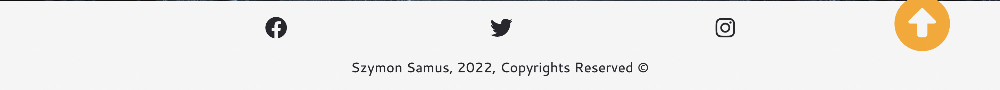

# UNDER THE ICE

Under The Ice is a website designed to draw users into the practice of using Cold Therapy to see benefits in their day to day life. This is projected with a neutral color scheme and clean displays of information.

### The website is structured into 5 segments
- The landing part of the page is native to the user and consists simply of a header, navigation section, and main image with a caption to subtly tell the user what the page is about.
- The science section includes a variety of benefits created by cold exposure, this lets the user read the benefits and see if it is something the user would like to accomplish. This draws a particular reader profile which aligns with the targetted audience.
- The Dive section which includes a small descriptive way of how to start practicing cold therapy at home, along with a supportive video which contains content of people describing experience with cold bathing.
- Committing section is a section which provides a small bit of text inspiring the user to push through and start practicing what the website is projecting, essentially a small hook to get users to sign up to the news letter.
- The footer which simply contains social media links that lead to the social media page, and copyright information.

### The Design of the Webpage
The website is designed with a neutral, calming but popping color scheme. The hints of orange bring attention to the user and is used on critical website functions such as highlighting important content, links or buttons.

 

To view the deployed project [click here.](https://sizimon.github.io/P1-RESUB/#start)

# INDEX 
* [Intro](#under-the-ice)
* [UXD](#uxd)
* [Features](#page-features)
* [Testing](#testing)
* [Site Deployment](#site-deployment)
* [CREDITS](#credits)

# UXD
Website Intentions: The website intends to hook a specific audience member, it seeks to throw forward benefits which maybe in alignment with what the user needs, therefore the user typically continues forward only if what the website has to offer is what the user is actually interested in. Increasing the chances of higher quality signups.

 
## FOR THE USER: 
For the user the experience is clean and attention is clearly drawn to important segments on the page, with this the user knows where to assign focus and images are calming yet attention drawing, keeping a nice balance for the user and allowing for easy navigation.

## FOR THE DEVELOPER:
For me as the developer, this being my resubmission I was aiming for this website to be designed in a way which required minimal work on the media queries end of the project, this was achieved for me by taking a different approach to the design of the website. 

I did this by making sure that at every step of the process which every new piece of content was introduced, I would also check that it looked good on other screen sizes. That really helped me take into consideration how to build the website with cleaner css and have a mentality of mobile first development to avoid any future hiccups.
 
## PROCESS:
- The Website follows a B2C structure which is intended for a target audience, thus it needs to grab the attention of that target audience, in order to generate signups.
- This was done by creating each section to be clearly displayed with a fluid flowpath for the reader.
- There is a description of how to start integrating the process into your life and a supporting and inspiring video for the user which is designed to hook via the appeal of a stronger mentality.
- All of this supported by a design that is clean as a result of the color scheme and the combination of font styles and page layout.

# PAGE FEATURES

## HEADER/NAV:
The header is accompanied by a simple nav bar and takes the user to certain points of the page, the document scrolling style was adjusted to make the navigation smooth so it feels cleaner. The navigation is also supported by a back to top button which takes the user back to the header/navigation for ease of use.

## MAIN IMAGE:
The main image is a designed to imprint calm in the user, but also contains a caption which prompts curiosity and adventure.

## LANDING PAGE: 
The landing page is a combination of the header, navigation and main image. This part of the page looks professional and inviting to all users, this is important as having a clean and relaxing webpage is what the design is trying to achieve.

## SCIENCE SECTION: 
This section is the informational content of the page, it is also the first filter for the audience we are trying to attract, it is people that would like to experience the benefits in this part of the page that is is targetting to attract.
It highlights the benefits that can be awarded for continuing to read the page and incorporating the Cold Therapy in your life.

## THE DIVE SECTION:
This section continues to show the target audience how easy it is to start incorporating it in your life, and hooks them in with a video that shows the kind of mentality that can be attained through following these methods, the video is kept short but shows the real sheer video evidence of how people incorporate the method into their lives.

## COMMITTING (SIGNUP):
The committing section is essentially the last step and also the signup process, it provides a last little bit of encouraging words for the user followed by a calming signup form to get the user to signup to the program.

## SOCIALS:
This section just contains relevenant social pages which the user may consider clicking on if they would like more of the same style of content. This is followed by a simple copyright and author footer.

### DESIGN CHANGES:
The design was initially a little different and the page was a little brighter due to lighter background images, however this caused issues with font color clashes and hard to reach captions/signup areas over the images. 
Therefore I opted for darker images which actually helped introduce a more calm enviroment to the webpage in general, which was the intention in the first place.
I am really happy with the change as it is more pleasing to open the page and the eyes are not immediatly attacked with a super bright webpage.

### FUTURE FEATURES: 
Future features which could be included would be; links to relevent scientific studies, animated background images to make the page more alive, and a booking section to book a session with a professional.

# TESTING 
Responsivness testing was done by use of chrome dev tools and opening the page on my mobile and my friends mobile to ensure that the website works well across multiple devices, so far after checking different dimensions, there is no problems with responsiveness.
    
## HTML:
Initially on the first validation I had some errors due to an unused "for" tag in the form label, after this was resolved the code passed HTML Validation with zero errors.

## CSS:
The code passed CSS validation without a single error.

## BUGS:
I encountered no major bugs during the development of this project, other than a simple bug which caused an issue on one screen size due to an overlapping pixel limit set on media queries. Also a minor bug which caused the embedded youtube video to not display because of a depreciated youtube embed attribute, these were quickly resolved. 

# SITE DEPLOYMENT
The site was created on GitPod first, then deployed by GitHub Pages, to deploy the site:
- In git hub repository, click settings.
- On the navigation bar, click pages.
- Change drop down menu in branch to main.
- Once Deployed it will display a link to the site.

# CREDITS

## MEDIA:
The main landing image was taken from [here](https://www.artstation.com/artwork/1nPEZe).

The signup background image was taken from [here](https://vsthemes.org/en/wallpapers/nature/24527-temnyj-zimnij-les.html).

The video is from the podcast by Wim Hof taken from his [Youtube](https://www.youtube.com/watch?v=aRr86-3rO-E) channel.

## TESTING/CREATION:

To test the responsiveness I used [Am I Responsive](https://ui.dev/amiresponsive).

To create a color strip that represents my webpage I used [Coolers](https://coolors.co/).

To process my favicon I used [Favicon](https://favicon.io/favicon-converter/).

To get desired icons I used [Font Awesome](https://fontawesome.com/).

Finally, for the fonts I used [Google Fonts](https://fonts.google.com/about).

## CODE:
Some code was helped by the love running header section video.
